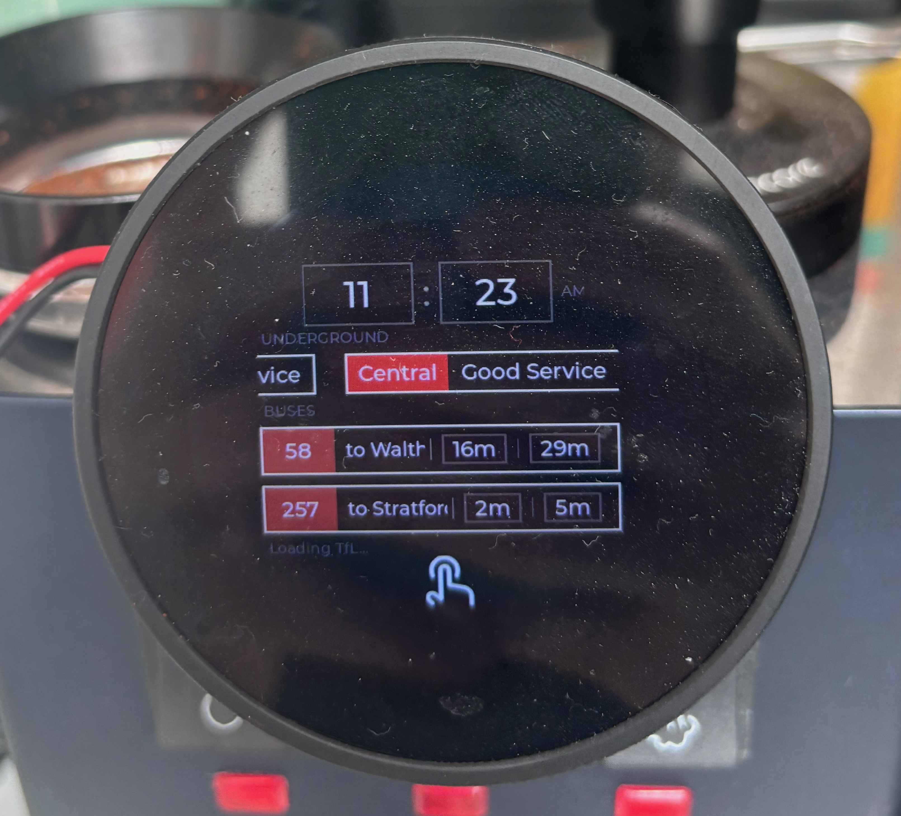

<p align="center">

<br />
  
[](https://discord.gg/APw7rgPGPf)
[![CC BY-NC-SA 4.0][cc-by-nc-sa-shield]][cc-by-nc-sa]

</p>

# GaggiMate TfL Edition

A fork of [GaggiMate](https://github.com/jniebuhr/gaggimate) that adds a **Transport for London screensaver** to the standby screen. While your machine is idle, the display shows live Tube line statuses and bus arrival times pulled from the TfL API.



> All standard GaggiMate features (temperature control, brew timer, steam mode, profiles, etc.) work exactly as normal. The TfL screensaver only activates on the standby screen when enabled.

## What you need

- A working **GaggiMate** setup (controller board + display). See [gaggimate.eu](https://gaggimate.eu/) for sourcing and assembly docs.
- A **TfL API key** (free) from [api-portal.tfl.gov.uk](https://api-portal.tfl.gov.uk/) - register and subscribe to a product to get your App ID and App Key.
- **WiFi** configured on your display (the screensaver fetches live data over the network).

## Flashing

This fork only changes the **display firmware**. Your controller firmware stays on the official GaggiMate release.

### Option 1: Pre-built binary (easiest)

1. Go to the [Releases](https://github.com/tsrobinson/gaggimate_tfl/releases) page (or the latest [Actions build](https://github.com/tsrobinson/gaggimate_tfl/actions)) and download the display firmware `.bin` file.
2. Open the GaggiMate web UI (connect to your display's IP in a browser).
3. Navigate to **Settings > Update** and upload the `.bin` file.
4. The display will reboot with the TfL edition firmware.

### Option 2: Build from source

Requires [PlatformIO](https://platformio.org/).

```bash
git clone https://github.com/tsrobinson/gaggimate_tfl.git
cd gaggimate_tfl
pio run -e display
```

To flash directly over USB:

```bash
pio run -e display -t upload
```

Or upload the built binary (`/.pio/build/display/firmware.bin`) via the web UI as in Option 1.

## Configuration

Once flashed, open the GaggiMate **web UI** in your browser and go to the settings page. You'll find a new TfL section with these options:

| Setting | Description | Example |
|---------|-------------|---------|
| **TfL Enabled** | Toggle the screensaver on/off | `true` |
| **App ID** | Your TfL API application ID | `a1b2c3d4` |
| **App Key** | Your TfL API key | `abc123def456...` |
| **Tube Lines** | Comma-separated line names to display | `central,victoria,jubilee` |
| **Bus Stop ID** | TfL stop ID for bus arrivals (NaPTAN code) | `490008660N` |
| **Bus Routes** | Comma-separated bus routes to show | `58,257` |
| **Style** | `0` = Roundel (dark with cream), `1` = Board (black with amber) | `0` |

### Finding your Bus Stop ID

1. Go to [tfl.gov.uk](https://tfl.gov.uk) and search for your bus stop.
2. The NaPTAN code is shown on the stop page, or in the URL (e.g. `490008660N`).
3. Alternatively, search the [TfL StopPoint API](https://api.tfl.gov.uk/StopPoint/Search?query=YOUR+STOP+NAME&modes=bus) for your stop.

### Tube line names

Use the standard TfL line identifiers: `bakerloo`, `central`, `circle`, `district`, `dlr`, `elizabeth`, `hammersmith-city`, `jubilee`, `metropolitan`, `northern`, `piccadilly`, `victoria`, `waterloo-city`.

## Display styles

| Roundel (style 0) | Board (style 1) |
|---|---|
| Dark background with cream/ivory text, coloured line chips | Black background with amber text, LED departure-board look |

## Fonts

The screensaver ships with [Overpass](https://overpassfont.org/) (OFL/LGPL licensed) as the default typeface. It's a clean, geometric sans-serif with a transport/wayfinding feel that works well on the small display.

### Using a custom font

If you'd prefer a different typeface, you can regenerate the font files from any TTF or OTF. You'll need Node.js installed.

1. Place your bold and light font files somewhere accessible.
2. Run the conversion script:

```bash
./scripts/generate_transit_fonts.sh path/to/your-bold.otf path/to/your-light.otf
```

This generates all 9 LVGL bitmap font files in `src/display/fonts/` at the correct sizes. Then rebuild and flash as normal.

If you only have a single weight, you can pass the same file for both arguments.

## How it works

- The **TransitScreensaverPlugin** runs on the display and fetches TfL API data every 15 seconds while in standby mode.
- Tube line statuses and bus arrivals are parsed and sent to the **TransitScreenRenderer** which draws the LVGL widgets on the standby screen.
- When you tap the screen or a brew starts, the display switches to the normal GaggiMate UI instantly.
- The TfL rendering is fully self-contained in its own files, so upstream GaggiMate updates merge cleanly.

## Keeping up to date

This fork tracks the official [jniebuhr/gaggimate](https://github.com/jniebuhr/gaggimate) repository. A GitHub Actions workflow runs weekly to detect new upstream releases and automatically creates a PR to merge them in. You can also trigger it manually from the Actions tab.

When a new official GaggiMate version comes out:
1. Update your **controller** firmware to the official release as normal.
2. Check this repo for a matching upstream sync PR, or pull the latest and rebuild.

## License

This work is licensed under CC BY-NC-SA 4.0. To view a copy of this license, visit https://creativecommons.org/licenses/by-nc-sa/4.0/

Based on [GaggiMate](https://github.com/jniebuhr/gaggimate) by jniebuhr.

[cc-by-nc-sa]: http://creativecommons.org/licenses/by-nc-sa/4.0/
[cc-by-nc-sa-image]: https://licensebuttons.net/l/by-nc-sa/4.0/88x31.png
[cc-by-nc-sa-shield]: https://img.shields.io/badge/License-CC%20BY--NC--SA%204.0-lightgrey.svg?style=for-the-badge
